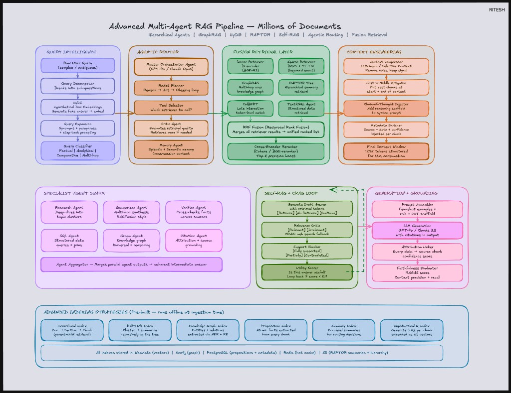

# Advanced multi-agent RAG at millions of documents

Reference diagram for a **production-style** pipeline: query rewriting, parallel fusion retrieval, specialist agents, context packing, and corrective loops. At this complexity, **wall-clock latency** almost always trades off against **grounding quality** — streaming improves perceived responsiveness but does not remove retrieval / rerank time.

<figure markdown="span">
  { width="100%" class="doc-diagram-img" }
  <figcaption><strong>Figure:</strong> Advanced Multi-Agent RAG — query intelligence, agentic routing, fusion retrieval, context engineering, specialist swarm, Self-RAG / CRAG, and offline indexing.</figcaption>
</figure>

---

## Section 1 — Query intelligence

**Theme:** make an underspecified user question “search-shaped” *before* touching the index.

### HyDE (Hypothetical Document Embeddings)

**Problem:** Short factual questions often embed poorly compared with how answers are written in corpora.

**Idea:** Ask an LLM for a **hypothetical answer** (not trusted as truth), embed **that** paragraph, and retrieve against it. The hypothetical text tends to share vocabulary and structure with real passages.

**Interview soundbite:** HyDE is a **query expansion into document space** — useful when lexical mismatch hurts dense retrieval.

### Query decomposer

**Problem:** One retrieval pass fails on tightly constrained, multi-part questions.

**Idea:** Split into sub-questions (each gets retrieval + merge). This is the retrieval analogue of **multi-hop** reasoning.

### Query expansion

Add synonyms, paraphrases, and **step-back** prompts (a broader question that retrieves surrounding concepts). Example: “metformin dosage” → biguanide dosing, brand names, diabetes regimen language.

### Query classifier

Route by intent:

| Route | Typical tactic |
|-------|----------------|
| Factual | Dense + light rerank |
| Analytical | Multi-step retrieve → synthesize |
| Comparative | Parallel retrieves + structured comparison scaffold |
| Multi-hop | Graph-aware retrieval / decomposition |

---

## Section 2 — Agentic router

**Theme:** a controller that **plans**, **calls tools**, **observes**, and **stops** when quality is sufficient.

### Master orchestrator (ReAct-style loop)

A repeating pattern:

1. **Reason** — classify difficulty, coverage gaps, risk.
2. **Act** — call retrievers / SQL / graph tools.
3. **Observe** — inspect evidence bundles and scores.

This differs from naive RAG (“retrieve k, prompt once”) because retrieval can repeat with **new sub-queries** or **different modalities**.

### Critic agent

After retrieval, ask whether evidence **actually supports** an answer. If not: rewrite queries, widen recall (BM25), narrow precision (reranker), or escalate modality (graph / SQL).

### Memory agent

Two useful caches:

- **Episodic:** prior sessions / tasks for the same user or tenant.
- **Semantic:** standing interests (“always pull guideline + interaction checker context for this role”).

Caches reduce duplicate retrieval — they also need **TTL**, **consent**, and **invalidation** policies in production.

---

## Section 3 — Fusion retrieval

**Theme:** **no single scorer** is sufficient at large scale; fuse complementary signals.

### Dense retriever (example: BGE family)

Embedding similarity finds **semantic neighbors** even with paraphrase.

### Sparse retriever (BM25)

Lexical matching preserves **tokens that matter** — drug names, identifiers, exact regulatory phrases — where dense models sometimes over-smooth.

**Together:** hybrid retrieval is the default serious baseline.

### GraphRAG

For relational questions (“along which biological / legal / dependency paths?”), traverse an explicit graph rather than hoping vector hops align.

### RAPTOR-style tree retrieval

Build **layers of summaries** above chunks. Broad questions hit higher levels; needle questions hit leaves. This aligns **retrieval granularity** to **question scope**.

### ColBERT (late interaction)

Token-level interactions boost precision on candidates — commonly applied to **top‑M** results for cost control.

### RRF (Reciprocal Rank Fusion)

Merge ranked lists without score calibration:

`RRFScore(d) = Σᵢ 1 / (k + rankᵢ(d))` (rank fusion across lists; pick `k` as a small constant like 60 in many implementations)

High consensus across rankers → robust fused ranking.

!!! note "Latency reminder"
    Parallel retrievers cut **elapsed time** versus sequential calls, but fan-out still consumes **CPU/GPU/IO** budgets — cap concurrency and candidate counts under load.

---

## Section 4 — Context engineering

**Theme:** the LM sees **tokens**, not your architecture — craft the bundle deliberately.

### Context compressor (e.g., LLMLingua-class ideas)

Use a smaller model or heuristic compression to drop boilerplate while preserving numbers, entities, and causal language. Goal: **lower cost** and **less distraction**, not creative paraphrase.

### Lost-in-the-middle mitigation

Prefer placing the **strongest evidence** at **beginning and end** of the packed context; bury weaker passages in the middle.

### Chain-of-thought injector

Add **explicit reasoning scaffolds** to the system/developer prompts when policy allows — especially for analytical / comparative prompts.

### Metadata enricher

Prefix passages with structured cues (source, date, doc type, chunk confidence). Helps attribution and **calibrated** hedging.

---

## Section 5 — Specialist agent swarm

Instead of one general call, **fan out** specialized workers (research, summarize, verify, SQL, graph, citations), then **aggregate**.

**Why it helps:** isolates failure modes, enables **parallelism**, and lets you choose cheaper models for narrow subtasks.

**Production caveat:** aggregation needs **deduplication**, **conflict resolution**, and **timeout budgets**.

---

## Section 6 — Self-RAG + CRAG loop

### Self-RAG (pattern)

Make retrieval **conditional** — the generator emits decisions like “retrieve vs continue” based on uncertainty or coverage.

### CRAG (corrective pattern)

Evaluate retrieved units:

| Label | Action |
|-------|--------|
| Relevant | Keep |
| Irrelevant | Drop |
| Ambiguous / stale | Rewrite query or switch tool (e.g., external search where permitted) |

### Support + utility gate

Check:

1. **Grounded support** — claims tied to evidence spans.
2. **Utility** — does this actually answer the user’s task?

If scores fall below threshold, **loop** with refined retrieval or a different modality.

---

## Section 7 — Advanced indexing strategies (offline)

This is what makes online retrieval fast and faithful.

### Hierarchical (parent–child) index

Retrieve a **small child** chunk for precision; hydrate **parent section** for surrounding context.

### Proposition index

Split passages into **atomic claims** for finer retrieval units (with metadata tying back to source offsets).

### Hypothetical questions index

For each chunk, pre-generate likely questions and embed them — improves recall for natural-language queries.

---

## End-to-end narrative example

**Query:** “Compare the efficacy of SGLT2 inhibitors vs GLP‑1 agonists for cardiovascular outcomes in Type 2 diabetes with heart failure.”

```text
1) QUERY INTELLIGENCE
   - Decompose into drug-class outcomes, HF populations, comparison scaffolding.
   - HyDE → hypothetical abstract-like paragraph for embedding.
   - Expansion → trial names, outcomes (e.g., MACE), class synonyms.
   - Classify → comparative + multi-evidence.

2) AGENTIC ROUTER
   - Plan parallel evidence gathering (trials + guidelines + safety).
   - Critic watches for missing comparator arm / HF subgroup.

3) FUSION RETRIEVAL (parallel, capped)
   - Dense + BM25 hybrid recall.
   - Graph expansion for mechanism / indication edges (if graph exists).
   - RAPTOR summaries for survey-style background chunks.
   - Late interaction rerank on top-M.

4) CONTEXT ENGINEERING
   - Compress fluff; place highest-quality trials at pack boundaries.
   - Attach citation-ready metadata.

5) GENERATION + LOOP
   - Draft structured comparison.
   - Verifier flags weakly supported claims → targeted second retrieval pass.

6) OUTPUT
   - Comparison table + narrative + citations + confidence notes.
```

---

## Key takeaway

**Naive RAG** — fixed retrieval budget, single generation step — often collapses at **large corpora** and **complex tasks**. **Production agentic RAG** adds routing, hybrid fusion, critique loops, and deliberate context packing — trading operational complexity (and often latency) for **recall, precision, and measurably lower hallucination risk** when monitored properly.
