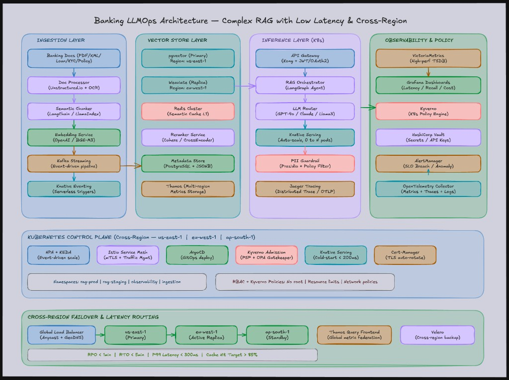

# Banking LLMOps architecture — complex RAG with low latency & cross-region

This reference stacks **document-heavy RAG** for banking policies and agreements with **semantic caching**, **reranking**, **policy gates**, and **multi-region Kubernetes** operations. Diagram SLOs such as **P99 &lt; ~300 ms** are **path-dependent**: streaming improves TTFT perception, but retrieval + rerank + guardrails still dominate wall-clock under load.

<figure markdown="span">
  { width="100%" class="doc-diagram-img" }
  <figcaption><strong>Figure:</strong> Banking LLMOps — ingestion → embeddings → Kafka/Knative triggers → pgvector + replica + Redis semantic cache → gateway → LangGraph orchestrator → model routing → guardrails → observability / GitOps / multi-region failover.</figcaption>
</figure>

---

## Big picture (beginner framing)

A **bank-internal copilot** over loans, KYC packs, and policy PDFs must:

- Answer with **document grounding** (avoid invented clauses / numbers).
- Mask **PII** consistently on egress — and often on ingress into logs.
- Stay **up** across regions with predictable failover drills.

---

## Layer 1 — Ingestion pipeline

| Piece | Role |
|-------|------|
| **Banking docs** | PDFs / scans / XML — mixed layouts require robust extraction. |
| **Unstructured.io + OCR** | Layout-aware parsing — tables often carry the money numbers. |
| **Semantic chunker** | Split on topical boundaries — aligns chunks with **meaningful citations**. |
| **Embedding service** | Domain multilingual embedders (e.g., strong general multilingual models) — validate on your corpus. |
| **Kafka** | Backpressure-friendly ingestion — replay drives reproducibility. |
| **Knative Eventing** | Event-triggered workers — scale toward zero between bursts. |

---

## Layer 2 — Vector store & retrieval

| Piece | Role |
|-------|------|
| **pgvector primary** | Postgres operational familiarity + vector ops — great default when teams already run Postgres. |
| **Weaviate replica (region B)** | Secondary region serving / DR posture — **consistency model** must be explicit (async replication lag). |
| **Redis semantic cache** | Cache **embedding-neighbor** hits of recent questions — tune TTL & tenant isolation. |
| **Reranker service** | Cross-encoder / API rerank — applied to top‑M to buys precision with extra latency. |
| **Postgres JSONB metadata** | Filters (product, branch, effective date) reduce hallucination surface area. |
| **Thanos-class metrics** | Long-horizon Prometheus metrics — proves regional regressions didn’t sneak in. |

---

## Layer 3 — Inference plane

| Piece | Role |
|-------|------|
| **Kong + JWT/OAuth2** | Enterprise IAM integration — tenant claims propagate to retrieval filters. |
| **LangGraph RAG orchestrator** | Agentic loops for clarification, multi-step policy checks, or tool calls (limits APIs). |
| **LLM router** | Cost/latency optimization — simple retrieves may stay on smaller models; contested legal-ish prompts escalate. |
| **Knative Serving** | Rapid scale-out — monitor cold-start **separately** from steady-state QPS. |
| **Presidio guardrail** | PII redaction / blocking — tune detectors per locale & script. |
| **Jaeger tracing** | Break down latency — proves whether Redis, pgvector, reranker, or LLM dominates P99. |

---

## Layer 4 — Observability & policy

| Piece | Role |
|-------|------|
| **VictoriaMetrics + Grafana** | Dashboard SLOs — latency, saturation, cost per query, reranker failure rates. |
| **Kyverno** | Enforce baseline pod security & quotas automatically. |
| **Vault** | Secret hygiene — short-lived credentials where possible. |
| **OpenTelemetry Collector** | Normalize telemetry pipelines — one instrumentation style across services. |
| **Alertmanager** | Wake humans on **customer-visible** slices — not every noisy secondary metric. |

---

## Layer 5 — Kubernetes control plane

| Piece | Role |
|-------|------|
| **HPA + KEDA** | Scale on CPU **and** external signals (queue depth, Kafka lag). |
| **Istio mesh** | mTLS + traffic shifting for canaries — pairs naturally with progressive delivery. |
| **Argo CD** | GitOps desired state — reconcile drift quickly after incidents. |
| **Cert-manager** | Automated TLS rotation — prevents expiry outages. |
| **Namespaces + RBAC** | Blast-radius separation (`rag-prod` vs `rag-staging`). |

---

## Layer 6 — Cross-region reliability

| Piece | Role |
|-------|------|
| **Global LB + GeoDNS** | Route users to healthy nearest region — explicit health checks required. |
| **Velero** | Cluster restore drills — test restores quarterly at minimum for serious teams. |
| **Backpressure everywhere** | Graceful degradation beats synchronized retry storms. |

**Targets often printed on diagrams**

| Objective | Example |
|-----------|---------|
| RPO / RTO | minutes-class DR claims — validate |
| P99 latency | **~300 ms** tier — assume **scoped** happy paths |
| Semantic cache hit rate | **~85%** aspirational — depends heavily on query entropy |

---

## End-to-end flow (loan clause lookup)

```text
Prior ingestion:
  Loan PDF → OCR/layout parse → semantic chunks → embeddings →
  Kafka → worker upsert → pgvector + metadata JSONB

Online question:
  Kong auth → orchestrator:
    - embed query → Redis semantic cache check
    - pgvector ANN recall → rerank top-M → pack evidence
  Router selects model tier
  Presidio scrubs answer payload → client
  Trace + metrics export → dashboards / alerts
```

---

## Design patterns called out by this diagram

| Pattern | Where it shows up |
|---------|-------------------|
| **Router** | LLM / model tier selection |
| **Agentic RAG** | LangGraph orchestrator loops vs one-shot retrieve |
| **Cache-aside semantic cache** | Redis cache before hitting ANN + rerank |
| **Active-active multi-region** | Read paths — writes need conflict governance |

---

## Study hooks back to Part I

- Treat **reranking + guardrails** as part of the **latency budget** — optimize TTFT with streaming, but measure **full task time** for SLAs.
- Tie **chunk boundaries** to **citation granularity**: clauses should not be split across unrelated chunks without parent hydration.

See also: [Advanced multi-agent RAG (millions of documents)](advanced-multi-agent-rag.md) for fusion-retrieval patterns beyond a single vector index.
