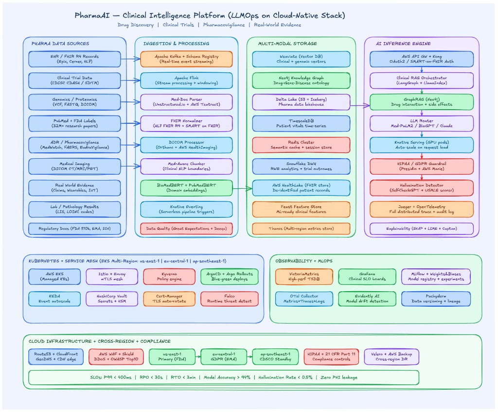

# Pharma clinical intelligence platform (LLMOps on cloud-native stack)

Diagram-first map of a **regulated healthcare** stack: heterogeneous clinical modalities, strong ingestion governance, **vector + graph + lake + time-series** storage, and an inference plane with **clinical RAG orchestration**, **GraphRAG**, **model routing**, and **safety / auditability** layers.

<figure markdown="span">
  { width="100%" class="doc-diagram-img" }
  <figcaption><strong>Figure:</strong> Pharma / clinical intelligence platform — sources → stream processing → Med-aware chunking & biomedical embeddings → multimodal stores → clinical RAG + guardrails → Kubernetes mesh → observability &amp; MLOps → global routing &amp; compliance.</figcaption>
</figure>

---

## Big picture (beginner framing)

Think of a **research-safe clinical copilot** that must:

- Combine **literature + labels + trials + EHR-derived facts** without inventing dosing or interactions.
- Respect **HIPAA** (US PHI controls) and **21 CFR Part 11** style audit expectations for many regulated workflows — plus regional regimes (EMA / CDSCO, etc.) when deployed broadly.
- Hit demanding **latency SLOs** for narrow pathways while accepting that **deep reasoning + multi-source retrieval** may need async / staged UX.

!!! warning "Not medical advice"
    Architecture sketches are **not** clinical protocols. Production systems require clinical governance, validation, human-in-the-loop policies, and jurisdictional legal review.

---

## Layer 1 — Pharma data sources

| Source | Plain-language role |
|--------|---------------------|
| **EHR / FHIR R4** | Normalized patient-chart artifacts for analytics and authorized retrieval — not “dump everything into the prompt.” |
| **Clinical trials (CDISC)** | Structured arms, outcomes, adverse events — feeds both analytics and grounded summaries. |
| **Omics (VCF / FASTQ)** | Variant / sequence evidence paths for precision medicine queries — heavy privacy & provenance. |
| **Literature + labels (PubMed / SPL)** | Peer-reviewed context + regulatory labeling text — core grounding corpora. |
| **Pharmacovigilance (FAERS / MedWatch-style)** | Real-world adverse event signals — rates, confounding, and reporting bias matter. |
| **Imaging (DICOM)** | Pixel data + metadata pipelines — often separate inference services from text RAG. |
| **Real-world evidence** | Claims / devices / wearables — linkage and selection bias controls dominate design. |
| **Labs (LOINC-coded)** | Structured numeric trajectories — pairs naturally with time-series stores. |
| **Regulatory corpus** | Guidances and filings — citation-heavy answers with effective dates. |

---

## Layer 2 — Ingestion & processing

| Component | Role |
|-----------|------|
| **Kafka + Schema Registry** | Durable streaming bus with **contracted schemas** — mandatory once dozens of producers exist. |
| **Flink** | Stateful stream processing (windows, enrichment, dedupe, alerts). |
| **Med-doc parsing** | OCR / layout-aware extraction for messy PDFs and scans. |
| **FHIR normalization** | Canonical shapes across vendors — reduces downstream branching. |
| **DICOM pipelines** | Metadata extraction, routing to viewers / inference, lifecycle policies. |
| **Med-aware chunker** | Segments by **clinical boundaries** (lists, dosing paragraphs, contraindications) instead of naive fixed windows. |
| **BioMedBERT / PubMedBERT embeddings** | Domain-aware semantic space — quote **evaluation on your tasks**, not just model names. |
| **Great Expectations / Deequ** | Dataset **contracts** — block silent schema drift and poisoning-class defects. |

---

## Layer 3 — Multimodal storage

| Store | Role |
|-------|------|
| **Vector DB (e.g., Weaviate-class)** | Semantic retrieval over chunked literature + notes + label text. |
| **Neo4j graph** | **Drug–gene–disease–pathway** constraints for GraphRAG / safety traversals. |
| **Delta / Iceberg lake** | Audit-friendly historical analytics — reproducible training snapshots. |
| **TimescaleDB** | Vitals, labs, longitudinal monitoring queries. |
| **Redis semantic cache** | Repeat query similarity caching — watch staleness for evolving labels. |
| **Warehouse (Snowflake-class)** | Enterprise analytics & cohort joins — separate from online retrieval hot paths. |
| **Managed FHIR stores** | Optionally centralize interoperable clinical artifacts with fine-grained access. |

---

## Layer 4 — AI inference engine

| Piece | Role |
|-------|------|
| **API gateway + Kong** | AuthN/Z, quotas, WAF integration points, request shaping. |
| **Clinical RAG orchestrator (LangGraph + LlamaIndex-class)** | Stateful graphs for **tool calls**, retrieval retries, and policy gates. |
| **GraphRAG** | Retrieve **relational explanations** (“along which mechanism edges is risk carried?”) complementary to vectors. |
| **LLM router** | Route cheap vs strong models by risk tier — document **fallbacks** and **refusal** behaviors. |
| **GPU serving (Knative-class)** | Scale-to-zero economics vs cold-start risk — prewarming for urgent pathways. |
| **Guardrails (Presidio + DLP-class)** | PHI minimization / redaction in prompts & outputs — **least-privilege context**. |
| **Hallucination controls** | Ensemble consistency checks, citation necessity, rubric scoring — tune **false alarm** vs **false safe**. |
| **Tracing (Jaeger / OTLP)** | End-to-end spans for latency debugging **and** audit narrative reconstruction. |
| **Explainability tooling** | Attribution to features / evidence spans — clinical workflows often require **inspectability**. |

---

## Layer 5 — Kubernetes + service mesh

Managed **EKS-class** clusters across regions with:

- **Istio / Envoy mTLS** — zero-trust east-west traffic.
- **Kyverno** — admission policies (no root, quotas, required labels).
- **Vault (+ HSM options)** — secrets, key ceremony, rotation.
- **Falco** — runtime anomaly signals complementary to policy engines.
- **Argo CD / progressive delivery** — safer model + config rollouts.
- **KEDA** — scale workers from **Kafka lag** and other external signals.

---

## Layer 6 — Observability & MLOps

| Piece | Role |
|-------|------|
| **VictoriaMetrics / Grafana** | SLO dashboards — latency, saturation, errors, **domain KPIs** (citation coverage, abstention rate). |
| **MLflow / W&B** | Experiment traceability — tie artifacts to datasets & commits. |
| **Evidently** | Drift / monitoring — trigger **human review** not blind automation. |
| **Pachyderm-class lineage** | Dataset **version pinning** for reproducibility narratives. |

---

## Layer 7 — Cloud, routing, compliance posture

- **Route53 + CloudFront** — geo routing and edge offload for eligible assets.
- **WAF + Shield-class controls** — volumetric and application-layer protections.
- **Multi-region** — data residency drives **partitioning**, not just failover.
- **Backups (Velero / managed backups)** — restore drills matter more than checkbox features.

Target-style **SLO examples** often cited on diagrams:

| Objective | Example target |
|-----------|----------------|
| Tail latency | **P99 &lt; ~400 ms** for tightly bounded paths |
| Recovery | aggressive **RPO/RTO** claims require proof via drills |
| Quality | accuracy / hallucination-rate budgets **per workflow tier** |

Interpret these as **design pressures**, not universal guarantees across every query type.

---

## End-to-end flow (oncology dosing style question)

```text
BACKGROUND INGESTION (continuous):
  Labels + literature + safety DBs → Kafka → Flink enrichment →
  parse/normalize → Med-aware chunks → BioMed embeddings →
  Weaviate indexes + Neo4j graph edges + lake archival

ONLINE QUESTION (authorized clinician):
  Geo-route → WAF → Gateway/OAuth → Orchestrator:
    - retrieve literature chunks + guideline excerpts
    - graph-expand interaction / organ-risk neighbors
    - attach authorized structured facts (never over-fetch PHI)
  Route to strongest medical-capable model tier for high-risk path
  Run PHI scrubbing + consistency checks + citation enforcement
  Trace spans + write immutable audit record (policy-dependent)
  Return answer with sources + explicit uncertainty + escalation markers
```

---

## Banking vs pharma (why pharma is stricter)

| Dimension | Banking RAG (typical) | Pharma / clinical (typical) |
|-----------|----------------------|-----------------------------|
| Modalities | PDFs, XML policies | FHIR, DICOM, omics, labs |
| Retrieval | Vectors + metadata filters | **Vectors + graph + time-series** constraints |
| Safety | PII masking / PCI controls | PHI minimization + **clinical risk** controls |
| Explainability | Often internal-only | Frequently **clinician-facing** expectations |
| Compliance | GDPR / PCI narratives | HIPAA / **21 CFR Part 11** class concerns + regional health law |
| Stakes | Financial loss | Patient harm & regulatory enforcement |

Shared backbone: **streaming ingestion**, **Kubernetes**, **GitOps**, **observability**, and **progressive delivery** — pharma adds **modal explosion**, **graph reasoning**, and **audit-heavy** inference governance.
